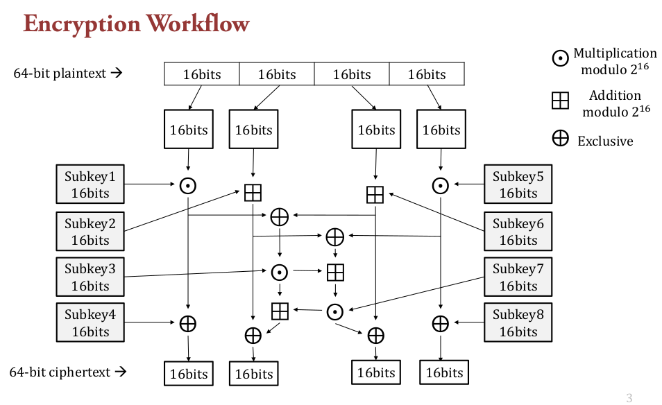

Decrypt the encryption algorithms with cryptanalysis
===============

## Project1

Decrypt the below encryption algorithm   

* Variant of **DES Structure**
* 4 plaintext-ciphertext pairs were given
  

## Project2

Decrypt the encryption algorithm which is the variant of **Diffe-Hellman** and **El-Gamal**.
